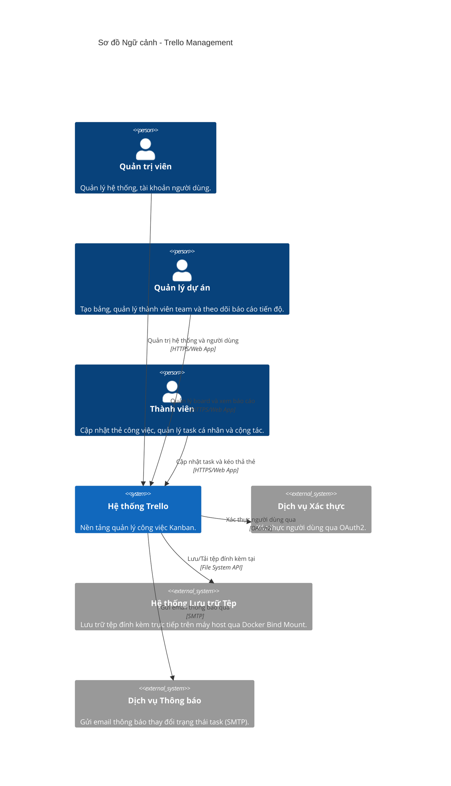

```mermaid
C4Context
    title Sơ đồ Ngữ cảnh - Trello Management
    
    Person(admin, "Quản trị viên", "Quản lý hệ thống, tài khoản người dùng.")
    Person(manager, "Quản lý dự án", "Tạo bảng, quản lý thành viên team và theo dõi báo cáo tiến độ.")
    Person(member, "Thành viên", "Cập nhật thẻ công việc, quản lý task cá nhân và cộng tác.")
    
    System(trello_system, "Hệ thống Trello", "Nền tảng quản lý công việc Kanban.")
    
    System_Ext(auth_service, "Dịch vụ Xác thực", "Xác thực người dùng qua OAuth2.")
    System_Ext(local_storage, "Hệ thống Lưu trữ Tệp", "Lưu trữ tệp đính kèm trực tiếp trên máy host qua Docker Bind Mount.")
    System_Ext(email, "Dịch vụ Thông báo", "Gửi email thông báo thay đổi trạng thái task (SMTP).")
    
    Rel(admin, trello_system, "Quản trị hệ thống và người dùng", "HTTPS/Web App")
    Rel(manager, trello_system, "Quản lý board và xem báo cáo", "HTTPS/Web App")
    Rel(member, trello_system, "Cập nhật task và kéo thả thẻ", "HTTPS/Web App")
    
    Rel(trello_system, auth_service, "Xác thực người dùng qua", "OAuth2")
    Rel(trello_system, local_storage, "Lưu/Tải tệp đính kèm tại", "File System API")
    Rel(trello_system, email, "Gửi email thông báo qua", "SMTP")
```
